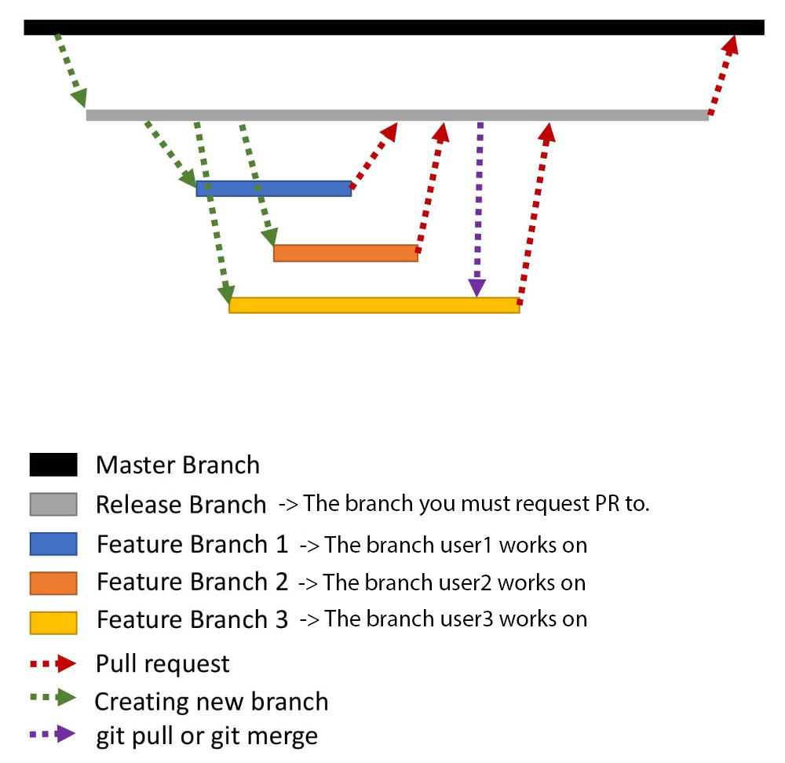

# Introduction

### Welcome

*First off, thank you for considering contributing to this repo.*

Following these guidelines helps to communicate that you respect the time of the developers managing and developing this open source project. In return, they should reciprocate that respect in addressing your issue, assessing changes, and helping you finalize your pull requests.

This website is an open source project and we welcome any contributions from our community! 

There are more ways to contribute that just fixing bugs and writing features - improving the design, submitting bug reports and opening issues are all great contributions and will be welcomed as much as any other.

#### Ground Rules
As contributors you should be respectful and considerate of others - both contributors and non-contributors alike. Please refer to the [code of conduct](CODE_OF_CONDUCT.md) for our and your responsibilities to the rest of the community.

### Your Responsibilities
* Ensure changes requested on PR's are done and not left behind.
* If you do find any issues or think of a feature please [create a Github issue](https://github.com/ceadoor/cea.ac.in/issues/new) for this first. Discuss things transparently and get community feedback.

---


### [Node.js LTS](https://nodejs.org/en/download/) and [npm](https://www.npmjs.com/get-npm) must be installed in your local machine.


## Quick Start



#### 1. Fork this repository to your account
#### 2. Clone the fork to your local machine
```
git clone https://github.com/username/cea.ac.in
```
#### 3. Switch to the directory 
```
cd cea.ac.in/
```
#### 4. Switch to ```release``` branch
```
git checkout release
```
#### 5. Create a new branch, say ```feature/test``` from ```release``` branch
```
git checkout -b feature/test release
```
#### 4. Install all packages (in Windows, use ```cmd```)
```
npm install
```
#### 5. Start Development Environment
```
npm start
```
This will provide you with a web interface available at **`http://localhost:8080/`**


## Note: 
You should never submit a Pull Request directly to main repo's ```master``` branch.

Instead the PR should be made to main repo's ```release``` branch. See the [reason](./blob/master/.github/instruction.jpg?raw=true)


---

# Your First Contribution

If you're not sure where to start issues we've labelled some issues with [#for-new-contributors](https://github.com/ceadoor/cea.ac.in/issues?q=is%3Aissue+is%3Aopen+label%3Afor-new-contributors) so these are a great place to start!

If you do decide to work on an issue comment saying you intend to pick it up and we'll assign it to you. If you decide it's too much however do tell us and we can try to help out or unassign it so it's free for someone else to pick up.

### New to contributing to open-source?
Working on your first Pull Request? You can learn how from this *free* series, [How to Contribute to an Open Source Project on GitHub](https://egghead.io/series/how-to-contribute-to-an-open-source-project-on-github).

At this point, you're ready to make your changes! Feel free to ask for help; everyone is a beginner at first :smile_cat:

---

# Loading Files

- Add your html files in the `src` directory (By default `index.html` is added to your `src` directory, feel free to make changes)

- Add images to your `src/assets` folder
- Add sass files to `src/scss` folder

  - Make sure you import the scss file in `main.scss`

    ```sass
    @import "filename";
    ```
    Then restart the development environment

## Note 
After adding html files or any other files webpack hasn't already tracked, make sure you reload the development environment normally with
```
npm start
```
---